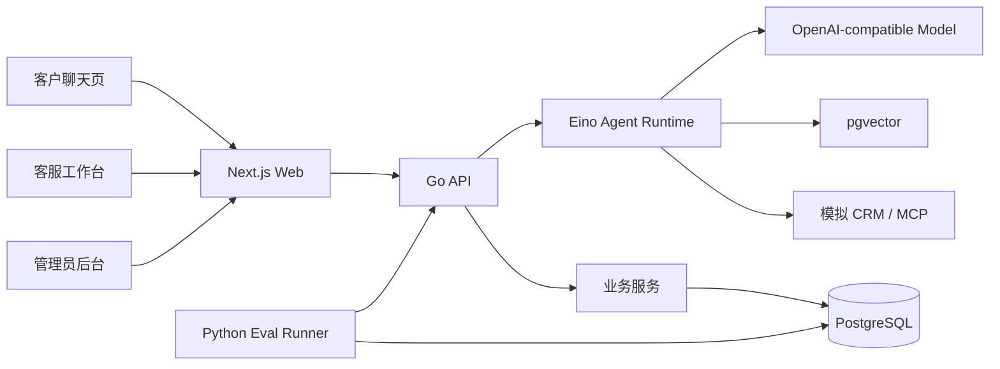
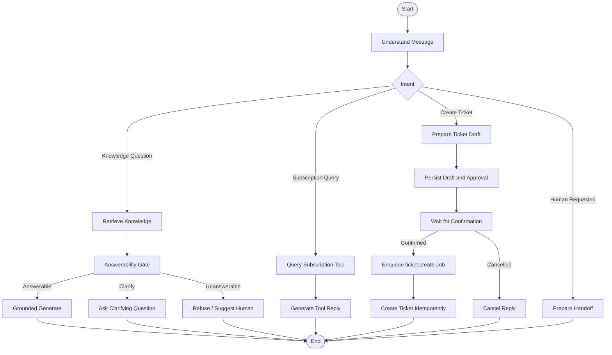

# Agent Chat 架构设计

## 1. 架构目标

系统需要同时满足：

- 展示完整 AI 应用工程能力，而不是仅封装模型 API。
- 保持 Agent 编排与业务领域解耦。
- 支持知识问答、工具调用、人工确认和转人工。
- 支持持久化任务、幂等、重试和服务重启恢复。
- 支持离线评估和运行追踪。
- 在单机 Docker Compose 环境中低成本运行。

## 2. 固定技术栈

### 2.1 后端

- Go
- Gin
- Eino
- GORM 或显式 SQL Repository
- PostgreSQL
- pgvector

### 2.2 前端

- Next.js App Router
- TypeScript
- shadcn/ui
- Tailwind CSS
- TanStack Table
- React Hook Form
- Zod
- React Flow
- Recharts

### 2.3 工程与部署

- Docker Compose
- GitHub Actions
- SSE
- WebSocket（人工工作台阶段）
- Python + pytest（离线评估）

## 3. 系统上下文



## 4. 分层

```text
Transport
  -> Application
    -> Domain
    -> Agent Runtime
      -> Infrastructure
```

### 4.1 Transport

职责：

- HTTP、SSE 和 WebSocket 协议处理
- 鉴权上下文解析
- 请求参数校验
- DTO 转换
- 错误响应映射

禁止：

- 直接访问数据库
- 编排业务事务
- 直接调用 Eino Graph

### 4.2 Application

职责：

- 用例编排
- 事务边界
- 权限与状态校验
- 调用领域服务和 Agent Runtime
- 创建持久化任务
- 幂等控制

典型用例：

- `SendCustomerMessage`
- `ResumeApproval`
- `TakeOverConversation`
- `CreateKnowledgeDocument`
- `RunEvaluationSuite`

### 4.3 Domain

职责：

- 会话状态机
- 消息和工单业务规则
- 审批状态机
- 知识文档版本规则
- 幂等键与领域事件

约束：

- 不依赖 Gin、GORM、Eino、OpenAI SDK 或具体数据库。
- 领域规则应通过单元测试直接验证。

### 4.4 Agent Runtime

职责：

- Eino ChatModel
- Eino Retriever 和 Embedding 适配
- Eino Compose Graph
- Tool 与 MCP 适配
- 工具规划、草稿生成与待确认输出
- Callback 与运行 Trace
- Prompt 和模型配置解析

Agent Runtime 不拥有：

- 会话、工单和用户的业务事务
- HTTP 请求处理
- 业务权限判断
- 外部副作用的最终授权

### 4.5 Infrastructure

职责：

- PostgreSQL Repository
- pgvector Retriever
- 模型 Provider
- CRM Client
- 工单 Client
- 持久化 Job Worker
- 日志和 Trace 存储

## 5. Eino 使用边界

### 5.1 采用的 Eino 能力

- `ChatModel`：屏蔽模型供应商差异。
- `Embedding`：生成查询与文档向量。
- `Retriever`：将 pgvector 检索暴露为统一组件。
- `compose.Graph`：编排可控的客服工作流。
- `Tool`：定义只读查询和写操作草稿。
- 用户确认首版不依赖进程内 `Interrupt/Resume` 或 Eino Checkpoint；Graph 只输出草稿，
  Application 通过 PostgreSQL 审批状态机和二次持久化 Job 恢复执行。
- `Callbacks`：收集节点、模型、工具和错误 Trace。

首版模型 Provider 固定为：

- `deepseek-v4-flash` 非思考模式负责 RAG 回答，复杂模型路由需在 Eval 证明收益后再引入。
- 智谱 `embedding-3` 生成 1024 维向量，索引与查询必须使用相同模型和维度。
- 每个索引版本必须持久化 `provider + model + dimensions`，查询前必须与当前 Embedder 身份完整匹配。
- Provider 配置位于通用 Config，Eino 和供应商协议实现仅位于 Infrastructure/Agent 边界。
- API Key 仅通过环境变量注入，不进入日志、Trace、错误正文或持久化配置。

知识版本发布使用逻辑文档的 `active_version_id`：

- 新版本创建和 `knowledge.index` Job 写入处于同一事务。
- 切片替换和版本变为 `ready` 处于同一事务。
- 只有属于当前文档且状态为 `ready` 的版本可以成为活动版本。
- 新版本发布前，旧活动版本继续参与检索；发布后检索只连接新的活动版本。
- 发布在数据库事务中比较版本号，乱序完成的旧索引不得覆盖较新的活动版本。
- 检索事务先校验所有活动版本的 Embedding 身份，再执行 pgvector 查询，避免同维度不同模型静默混用。

首版切片规则保持确定性并纳入版本化 Eval：

- FAQ 将标题作为问题、版本内容作为答案，优先保持为单个原子切片。
- Markdown 先按空行拆分结构块，再在 1200 rune 上限内打包。
- 超长结构块使用 120 rune 重叠窗口，避免边界事实完全断开。
- Worker 按 64 条一批调用 embedding Provider，切片 ID 由版本和位置稳定生成。

基础 RAG Graph 使用确定性 Answerability Gate：

- 最强证据分数达到 `0.68` 才进入受知识约束的模型生成。
- 分数位于 `0.55` 到 `0.68` 之间时返回 `needs_clarification`，不调用模型。
- 低于 `0.55` 或没有证据时返回 `unanswerable`，不调用模型并提供转人工动作。
- 检索内容以不可信 JSON 数据进入 Prompt，内容中的指令不得改变系统策略。
- 模型回答必须携带合法来源标记；服务端只返回回答显式标注且能映射到检索上下文的引用。
- 阈值依据智谱 `embedding-3` 在真实 FAQ 上的余弦分布标定，不是先验假设；实测
  可回答与不可回答两簇仅相距 `0.0177`，因此安全边界与最高的不可回答分数保持
  `0.086` 余量，宁可降级为澄清也不在证据不足时生成结论。
- 当前标定仅基于 5 条 FAQ 和 10 个查询，置信度有限；语料或 embedding 模型变化后
  必须重新测量，并同步 Answerability Eval Case 与宏平均 F1。

Eino Retriever 边界：

- 构造时绑定服务端授权后的知识库 ID，调用级 `Index` 只能省略或传入同值。
- 禁止调用级覆盖 Embedder，查询和索引始终使用同一 `provider + model + dimensions`。
- `TopK` 限制为 1-100，相似度阈值必须是 -1 到 1 之间的有限值。
- `DSLInfo` 只接受 `metadata` JSON 包含过滤，不接收 SQL 或任意表达式。
- 服务端必需过滤条件不可被调用级参数覆盖，且在构造时深拷贝。
- Eino `Document` 保存 chunk、document、version、类型、标题、分数和排序，供后续引用与 Trace 使用。
- Eino Callback 已记录实际执行的 Lambda 节点与 ChatModel，保存状态、耗时和 Token；不保存完整 Prompt、API Key 或供应商错误正文。
- 检索证据、Answerability 决策和最终引用继续通过有序 Run Event 持久化，管理员 Run 详情将二者组合展示。

### 5.2 首版不采用

- 多 Agent 自主协作
- Deep Agent
- 自动规划和无限循环
- 动态生成任意工具
- 可视化工作流编辑
- 处于实验阶段且会增加迁移成本的 API

### 5.3 Agent Graph

当前代码先实现知识问答子图，即 `Retrieve -> Answerability Gate -> Generate / Clarify / Refuse`。
意图识别、工具调用、审批和转人工节点按后续阶段接入，不为了展示框架提前放入空节点。



## 6. 可靠执行

### 6.1 在线请求

在线请求只负责：

1. 保存客户消息。
2. 创建 Agent Run 和持久化 Job。
3. 返回 SSE 连接或运行 ID。

Worker 负责真正执行 Agent Graph，避免裸 goroutine 在服务重启时丢失任务。

`agent.run` 的单次尝试按以下顺序执行：

1. 锁定 Run 与 Conversation，将 Run 切换为 `running` 并追加 `run.started`。
2. 使用会话绑定的 Knowledge Base 创建隔离 RAG Runtime，客户端和模型不能覆盖资源范围。
3. 执行检索、Answerability Gate 和受约束生成。
4. 在同一事务中保存 Assistant Message、Graph Result、有序事件和 Run 终态。
5. 可重试失败保持 Run 为 `running` 并等待 Job 重投；不可重试或耗尽次数后原子进入 `failed`。

如果执行期间会话已转为 `human_active`，完成事务拒绝保存 AI 回答，防止客服接管后出现迟到消息。

### 6.2 Job 状态

```text
pending -> running -> succeeded
                   -> retry_wait -> running
                   -> failed
```

每个 Job 需要：

- 唯一任务 ID
- 任务类型
- 业务幂等键
- Payload
- 尝试次数
- 下次执行时间
- 锁定时间与 Worker
- 最后错误

执行与恢复约束：

- Worker 只领取和恢复当前进程已注册的任务类型，未支持的类型保持原状态。
- 领取使用 `FOR UPDATE SKIP LOCKED`，状态、尝试次数和租约在同一 SQL 中原子更新。
- 只有租约持有者可以提交成功或失败，防止锁恢复后的旧 Worker 覆盖新结果。
- 可重试错误使用有上限的指数退避；不可重试错误或耗尽次数后进入 `failed`。
- Handler 原始错误不得进入日志或数据库，只保存稳定错误码。
- 单次执行超时必须小于锁超时；进程异常退出后，其他 Worker 将过期任务恢复为 `retry_wait` 或 `failed`。
- Handler 必须保证副作用幂等，因为业务操作成功后、任务状态提交前崩溃会造成再次投递。

### 6.3 幂等

- 客户消息使用客户端消息 ID 去重。
- Agent Run 对来源消息建立唯一约束。
- Assistant Message 对 Agent Run 建立唯一约束，任务重放不会生成重复回答。
- 同一会话内并发提交由会话行锁串行化；同一客户端消息 ID 只有内容一致时才视为重放。
- 创建工单使用审批 ID 作为 Job 幂等键，并在 Job Payload 中持久化稳定的工单 ID 和编号。
- 确认使用审批行锁和条件状态转换防止重复消费；Worker 重试复用同一 Payload。

### 6.4 事务

以下操作必须在事务中完成：

- 消息入库、会话状态更新和 Agent Job 创建。
- 审批确认、确认事件和 `ticket.create` Job 创建。
- 转人工事件、会话状态更新和通知任务创建。
- 文档版本创建和索引任务创建。

当前聊天启动事务一次写入：

1. `customer` 消息。
2. 唯一关联来源消息的 `pending` Agent Run。
3. `sequence = 1` 的 `run.status` 事件。
4. 以 Run ID 为幂等键的 `agent.run` Job。
5. 会话最后活跃时间。

当前聊天完成事务一次写入：

1. 唯一关联 Run 的 `assistant` 消息。
2. 包含回答、路由与证据的 Graph Result。
3. 连续递增的检索、Answerability、消息、引用和终态事件。
4. Agent Run 的 `completed` 终态和会话最后活跃时间。

若 Graph 生成工单草稿，同一完成事务还会写入 `pending` 审批以及
`approval.required` 事件；任何后续写入失败都会连同审批一起回滚，避免出现孤立审批。
确认请求只负责原子切换审批状态并创建 `ticket.create` Job，工单由 Worker 在独立事务中
幂等创建，因此 API 或 Worker 重启不会丢失已经确认的写操作。

会话的 `customer_id` 来自服务端鉴权主体，不接受模型决定；客户资料表和客户创建流程在后续身份接入阶段实现。

## 7. 数据模型

### 7.1 会话

- `customers`
- `conversations`
- `messages`
- `conversation_events`
- `handoff_summaries`

### 7.2 知识

- `knowledge_bases`
- `knowledge_documents`
- `knowledge_document_versions`
- `knowledge_chunks`
- `knowledge_index_jobs`

`knowledge_chunks` 包含 pgvector 向量列、文档版本、元数据和活动状态。

### 7.3 Agent

- `agent_configs`
- `agent_config_versions`
- `agent_runs`
- `run_events`
- `agent_run_steps`
- `retrieval_traces`
- `tool_calls`
- `ticket_approvals`

### 7.4 工单与工具

- `tickets`
- `ticket_events`
- `customer_subscriptions`
- `jobs`

### 7.5 Eval

- `eval_suites`
- `eval_cases`
- `eval_runs`
- `eval_results`

首版 Eval Case 也可以使用版本控制中的 JSONL，数据库只保存运行结果。

## 8. API 设计

### 8.1 客户端

```text
POST /api/v1/conversations
POST /api/v1/conversations/{id}/messages
GET  /api/v1/conversations/{id}/events
GET  /api/v1/ticket-approvals/{id}
POST /api/v1/ticket-approvals/{id}/confirm
POST /api/v1/ticket-approvals/{id}/cancel
POST /api/v1/conversations/{id}/request-human
```

### 8.2 客服端

```text
GET  /api/v1/agent/conversations
POST /api/v1/agent/conversations/{id}/takeover
POST /api/v1/agent/conversations/{id}/messages
POST /api/v1/agent/conversations/{id}/resume-ai
```

### 8.3 管理端

```text
POST /api/v1/admin/knowledge/documents
GET  /api/v1/admin/knowledge/documents
GET  /api/v1/admin/agent-runs/{id}
POST /api/v1/admin/evals/runs
GET  /api/v1/admin/evals/runs/{id}
```

## 9. SSE 协议

建议事件：

```text
run.started
run.status
message.delta
message.citation
tool.started
tool.completed
approval.required
approval.confirmed
approval.cancelled
approval.expired
ticket.created
handoff.created
run.completed
run.failed
```

每个事件包含：

```json
{
  "eventId": "evt_xxx",
  "runId": "run_xxx",
  "sequence": 1,
  "type": "message.delta",
  "createdAt": "2026-01-01T00:00:00Z",
  "payload": {}
}
```

`sequence` 用于断线重连和客户端去重。

## 10. Trace

统一关联字段：

- `request_id`
- `conversation_id`
- `message_id`
- `run_id`
- `step_id`
- `tool_call_id`
- `job_id`

Trace 数据分为：

- 业务事件
- Eino Callback 事件
- 检索明细
- 工具调用
- 审批与恢复
- 错误与重试

敏感数据写入前必须脱敏。

## 11. 安全设计

- 系统 Prompt 与检索内容分离，检索内容标记为不可信参考资料。
- Tool 参数必须通过结构化 Schema 和服务端校验。
- Agent 不能决定当前客户身份和权限范围。
- 工具使用白名单，写操作额外要求确认。
- 模型输出不能直接拼接 SQL、URL 或系统命令执行。
- 外部 HTTP 工具限制目标地址并防止 SSRF。
- Trace 不记录 API Key、Authorization 和完整敏感字段。

## 12. 推荐目录

```text
.
├── cmd/
│   ├── api/
│   └── worker/
├── internal/
│   ├── bootstrap/
│   ├── transport/http/
│   ├── application/
│   ├── domain/
│   ├── agent/
│   │   ├── graph/
│   │   ├── components/
│   │   ├── tools/
│   │   ├── prompts/
│   │   └── tracing/
│   ├── infrastructure/
│   │   ├── persistence/
│   │   ├── model/
│   │   ├── vector/
│   │   └── crm/
│   └── pkg/
├── migrations/
├── web/
├── evals/
│   ├── cases/
│   ├── runner/
│   └── reports/
├── docs/
├── docker-compose.yml
├── Makefile
└── AGENTS.md
```

## 13. 架构决策记录

重要决策应写入 `docs/adr/`：

- 为什么选择 Eino。
- 为什么首版选择 pgvector。
- 为什么写操作必须中断确认。
- 为什么使用持久化 Job，而不是裸 goroutine。
- 为什么首版不做多 Agent 和可视化工作流。
