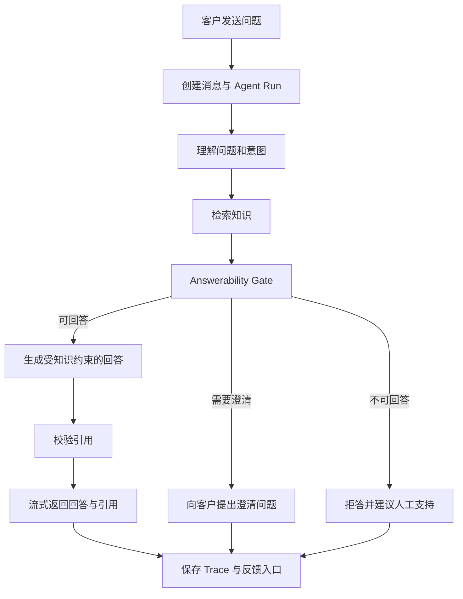
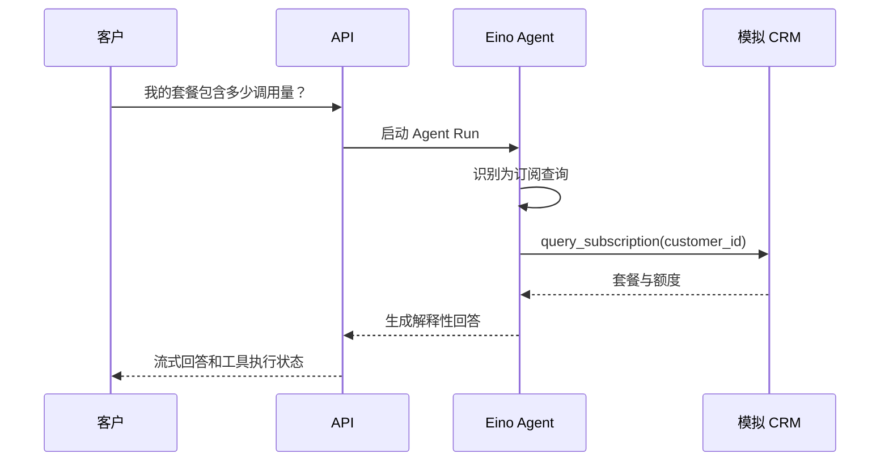
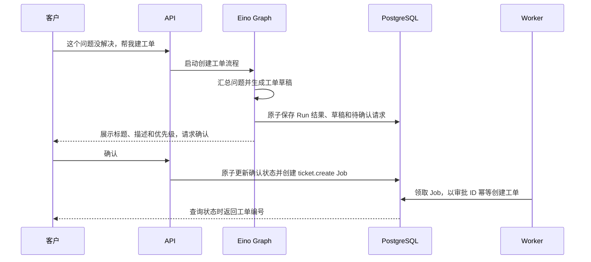
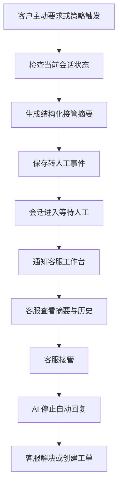
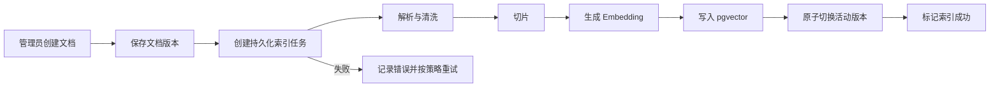

# Agent Chat 用户流程

## 1. 流程原则

- 知识问答优先使用可验证的企业知识。
- 不确定时追问或拒答，而不是补全未知事实。
- 读操作可以在授权范围内自动执行。
- 写操作必须先展示将要执行的内容并等待确认。
- 人工接管后，AI 默认停止自动回复。
- 每条链路必须留下可检索的 Trace。

## 2. 知识问答



关键状态：

- `run.started`
- `retrieval.completed`
- `answerability.decided`
- `generation.streaming`
- `run.completed`
- `run.failed`

## 3. 查询订阅信息



约束：

- 只能查询当前会话关联客户。
- Agent 不能自行构造其他客户 ID。
- CRM 不可用时，不得猜测订阅状态。

## 4. 创建技术支持工单



取消路径：

1. 用户回复取消。
2. 系统将确认请求标记为 `cancelled`。
3. 工作流结束。
4. 工单服务不得被调用。

异常路径：

- 重复确认：返回第一次执行结果。
- 确认过期：提示重新发起。
- 工单服务超时：任务进入可重试状态，不重复建单。

## 5. 转人工



接管摘要至少包含：

- 客户当前诉求
- 已确认事实
- 未解决问题
- 风险信号
- 已引用知识
- 已调用工具及结果
- 推荐下一步

## 6. 知识导入与索引



更新文档时：

- 新版本索引完成前，旧版本继续服务。
- 新版本完成后，原子切换活动版本。
- 旧向量异步清理，不得与新版本混合返回。

## 7. 人工接管后的状态

会话状态建议：

```text
ai_active
  -> waiting_human
  -> human_active
  -> resolved
```

允许的特殊转换：

```text
human_active -> ai_active
```

只有客服明确恢复 AI 后才能发生该转换。

## 8. Trace 查看

管理员从一次会话进入运行详情，应能按顺序看到：

1. 用户消息和运行配置版本。
2. Eino Graph 节点路径。
3. 检索查询、命中、分数和使用情况。
4. Answerability 结果和理由。
5. 模型调用与 Token。
6. 工具输入、输出、耗时和错误。
7. 审批请求、状态事件和持久化 Job 执行结果。
8. 最终回答、引用与结束状态。
